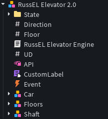

  <h1>RussEL - Новый контроллер лифта для Roblox Studio</h1>
  
Что это такое? - Это специальный движок который написан с нуля и плюс он почти работает как Cobalt.

  <h2>Вот плюсы контроллера</h2>
  <ol>
    <li>
      <h2>Работает с современным API</h2>
    </li>
    <li>
      <h2>Работает физика движения</h2>
    </li>
  </ol>
  

    <h1>Вот схема в Roblox Studio с контроллером</h1>
    
  

   

    <h1>Пример:</h1>
    
  

  <h1>Ссылка на игру:</h1>
  

